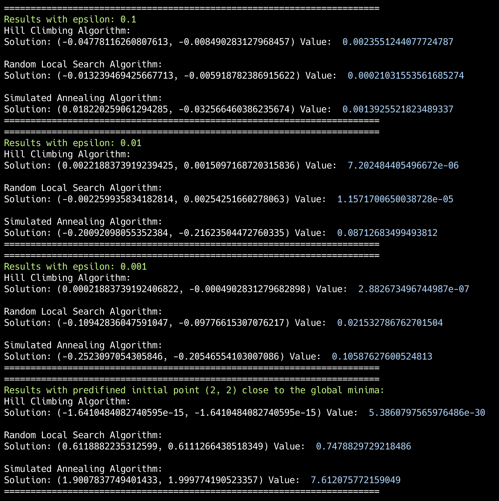

# goit-algo2-hw-09
Design and Analysis of Algorithms: Applied optimization techniques, including Hill Climbing, Random Local Search, and Simulated Annealing, to solve the sphere minimization problem in a multidimensional space. Analyzed and compared their performance in finding optimal solutions.

After conducting multiple global minimum searches with varying step sizes and predefined initial points, we obtained the following results:

The Hill Climbing algorithm provided the best performance, while Random Local Search yielded slightly worse but still acceptable results. Simulated Annealing proved to be the least efficient for this task.